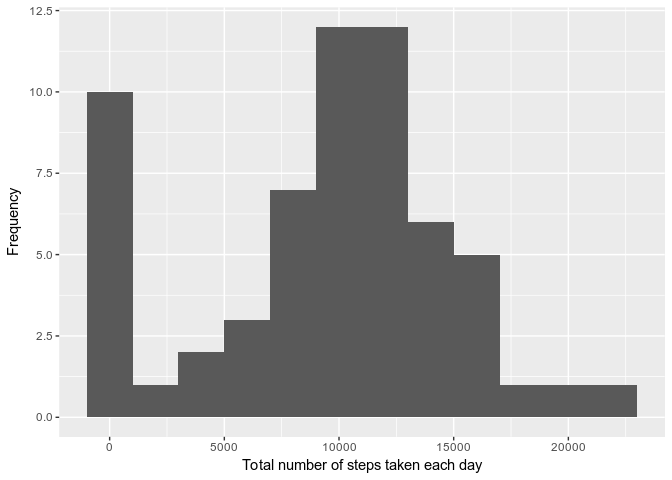
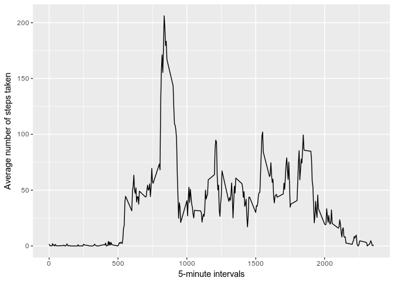
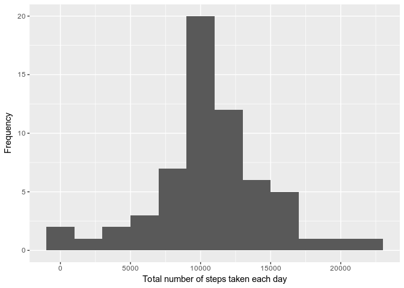
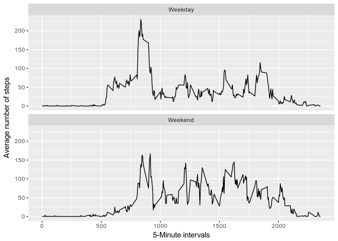

# Reproducible Research: Peer Assessment 1

## About 

This is a project under the **Reproducible Research** course in Coursera's Data Science Specialization track. The objectives of this project are:

* load and preprocess data;
* impute missing values; and,
* interpret the data to answer some research questions 

## Data 

The data for this assignment was downloaded from the course web site:

* **Dataset**: [Activity monitoring data [52K]](https://d396qusza40orc.cloudfront.net/repdata%2Fdata%2Factivity.zip)

The variables included in this dataset are:

* **steps**: Number of steps taking in a 5-minute interval (missing values are coded as NA)

* **date**: The date on which the measurement was taken in YYYY-MM-DD format

* **interval**: Identifier for the 5-minute interval in which measurement was taken

The dataset is stored in a comma-separated-value (CSV) file and there are a total of 17,568 observations in this dataset.

## Loading and preprocessing the data

```r
unzip("activity.zip")
data <- read.csv("activity.csv")
```

## What is mean total number of steps taken per day?


```r
library(ggplot2)
library(dplyr)
```

```
## 
## Attaching package: 'dplyr'
```

```
## The following objects are masked from 'package:stats':
## 
##     filter, lag
```

```
## The following objects are masked from 'package:base':
## 
##     intersect, setdiff, setequal, union
```

```r
total_steps <- data %>%
  group_by(date) %>%
  summarise(daily_steps = sum(steps, na.rm = TRUE))

ggplot(total_steps, aes(daily_steps)) + geom_histogram(binwidth = 2000) +
  xlab("Total number of steps taken each day") + 
  ylab("Frequency")
```

<!-- -->


```r
mean = mean(total_steps$daily_steps, na.rm=TRUE)
median = median(total_steps$daily_steps, na.rm=TRUE)
```

The mean is number of daily steps is 9354.22950819672 and the median of number of daily steps is 10395.

## What is the average daily activity pattern?

The following figure shows the total number of steps taken each day.


```r
## Make a histogram of the total number of steps taken each day
interval_steps <- data %>% 
  group_by(interval) %>%
  summarise(steps = mean(steps, na.rm =TRUE))

ggplot(data=interval_steps, aes(x=interval, y=steps)) +
    geom_line() +
    xlab("5-minute intervals") +
    ylab("Average number of steps taken")
```

<!-- -->

On average across all the days in the dataset, the 5-minute interval that contains the maximum number of steps is the 835th interval.

## Imputing missing values


```r
# Calculate and report the total number of missing values 
# in the dataset (i.e. the total number of rows with `NA`s)
missing <- !complete.cases(data)
```

The total number of missing 2304.

I used mean as values for imputing the number of steps for missing values. To impute the missing values in the data, firstly, I matched the averages by interval across dates with the intervals in the original data.


```r
# impute missing steps with interval averages across days
imputed_data <- data %>%
  mutate(
    steps = case_when(
      is.na(steps) ~ interval_steps$steps[match(data$interval, interval_steps$interval)],      
      TRUE ~ as.numeric(steps)
    ))
```

We now re-make the histogram of the total number of daily steps using the imputed data.


```r
imputed_total_steps <- imputed_data %>% group_by(date) %>% summarise(daily_steps = sum(steps))

ggplot(imputed_total_steps, aes(daily_steps)) + 
  geom_histogram(binwidth = 2000) + 
  xlab("Total number of steps taken each day") + 
  ylab("Frequency")
```

<!-- -->

We now compute the mean and median number of daily steps of the imputed data.


```r
imputed_mean = mean(imputed_total_steps$daily_steps, na.rm=TRUE)
imputed_median = median(imputed_total_steps$daily_steps, na.rm=TRUE)
```

We can calculate the difference of the means and medians between imputed and original data.


```r
mean_diff <- imputed_mean - mean 
median_diff <- imputed_median - median
```


After imputation, the mean number of daily steps is 1.076618867925\times 10^{4} and the median number of daily steps is 1.076618867925\times 10^{4}. The imputation procedure using the mean as replacement to the missing values seems to have increased the values of the mean and median. This is evident in the peaking of the histogram around the mean and median of the imputed mean. The histogram of the original data also reported the missing values as 0. The imputation has taken from the frequencies of the missing values and placed them around the means of the intervals across days. Specifically, we observe that:

* The difference between imputed mean and the non-imputed mean is 1411.95917104856; and,
* The difference between the imputed median and the non-imputed median is 371.188679245282.


## Are there differences in activity patterns between weekdays and weekends?

First, let's find the day of the week for each measurement in the dataset. In
this part, we use the dataset with the filled-in values.


```r
library(lubridate)
```

```
## 
## Attaching package: 'lubridate'
```

```
## The following object is masked from 'package:base':
## 
##     date
```

```r
day_of_week <- imputed_data %>%
  mutate(
    date = ymd(date),
    weekday_or_weekend = case_when(wday(date) %in% 2:6 ~ "Weekday",
                                   wday(date) %in% c(1,7) ~ "Weekend")
  ) %>% select(-date) %>%
  group_by(interval, weekday_or_weekend) %>%
  summarise(
    steps = mean(steps)
  )
```


```r
ggplot(day_of_week, aes(interval, steps)) + 
  geom_line() + 
  facet_wrap(~weekday_or_weekend, nrow = 2) +
  xlab("5-Minute intervals") + 
  ylab("Average number of steps")
```

<!-- -->


* During weekdays, a lot of walking is done between the 500th and 1000th intervals. 
* During weekends, some of the walking is shifted between the 1000th and 1750th intervals.
